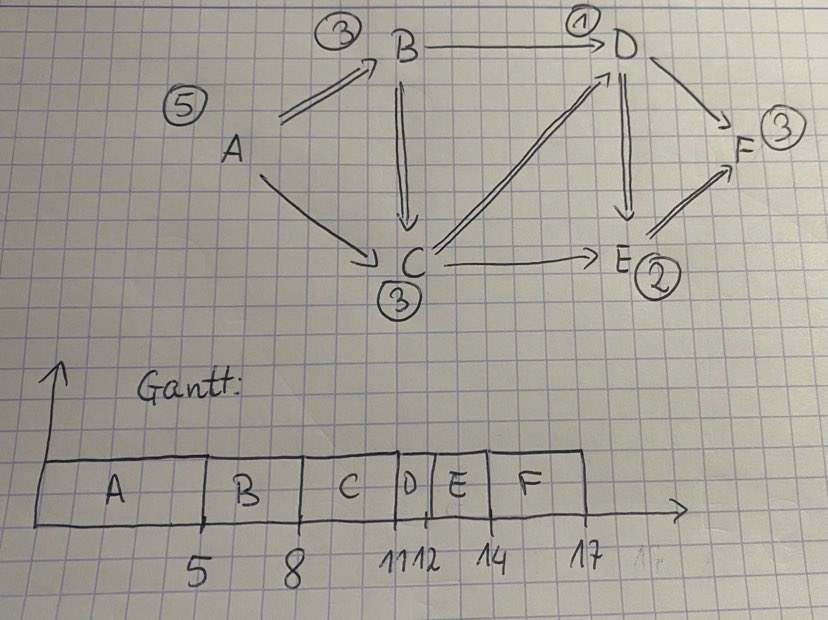

# Critical Path Method

CPM algorithm for an AN newtork (activity on nodes).
* User enters tasks/ AN network
* program check whether the given digraph is acyclic
* program for each task calculates the earliest and latest start time of the task
* shows the order of tasks (Gantt schedule)

## Input specification
In the first line of standard input user enters the number of tasks (nodes). Then we specify every node name, its duration $(>0)$, number of the direct ancestors and names of their nodes (ancestors must be first added as a node to be ancestor of something, this prevents the formation of cycles, **also first node can't have any ancestor**).

### remarks
* the graph must be acyclic and directed
* Gantt schedule works on up to 5 machines

## Output specification
The program simulates the CPM algorithm and returns the names of the nodes in the order
in which the critical path was created. The earliest start (es), latest start (ls), earliest end (ee),
latest end (le) of each node is also calucalted). Finally, the Gantt schedule is displayed.

## Example

### Input
6  
A  
5  
B  
3  
1  
A  
C  
3  
2  
A  
B  
D  
1  
2  
B  
C  
E  
2  
2  
C  
D  
F  
3  
2  
D  
E  

### Output
A B C D E F  
C max = 17  
A: es=0, ls=0, ee=5, le=5  
B: es=5, ls=5, ee=8, le=8  
C: es=8, ls=8, ee=11, le=11  
D: es=11, ls=11, ee=12, le=12  
E: es=12, ls=12, ee=14, le=14  
F: es=14, ls=14, ee=17, le=17  
Gantt schedule:   
M1: |0:5|A |5:8|B |8:11|C |11:12|D |12:14|E |14:17|F  

